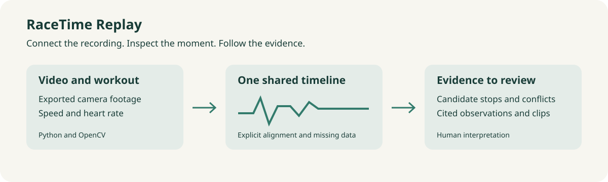

# RaceTime Replay

**See the run behind the numbers.** A Python application that aligns runner video with workout data so athletes can review candidate stops, source disagreements and the evidence behind an explanation.

[Product story](docs/PRODUCT.md) · [Week-by-week evidence](docs/WEEKLY_MAPPING.md) · [Developer guide](docs/DEVELOPER_GUIDE.md) · [Data guide](docs/DATA_GUIDE.md) · [Safety](docs/SAFETY.md) · [Nebius integration](docs/NEBIUS.md) · [Braintrust observability](docs/OBSERVABILITY.md)



## Who this is for

Trail runners and endurance athletes who want to revisit moments in their own recordings. Coaches and crew can review shared clips with permission. The first version saves the manual step of aligning separate evidence sources; measured time savings and performance benefits are still future validation work.

GoPro, Insta360, iPhone and camera-equipped Meta glasses offer several ways to capture first-person video. A watch records a different view of the same session. RaceTime accepts exported files and brings those records together. It does not claim every device supplies continuous video or identical metadata.

## Run locally

```bash
git clone https://github.com/sivalinb/racetime-replay.git
cd racetime-replay
python3.12 -m venv .venv
source .venv/bin/activate
python -m pip install -r requirements.txt
streamlit run app.py
```

The bundled 90-second demo runs without an API key. It is a generated motion fixture with invented workout values, not real trail footage. Select **Upload my recording** for your own MP4/MOV plus CSV, GPX or Health XML. Read the data guide for timestamp conventions. The prototype limits video to 15 minutes and 150 MB. For a public demo, set `REPLAY_ALLOW_UPLOADS=false`.

## What works

- OpenCV video decoding, optical-flow motion and quality measurements.
- CSV, GPX and bounded Apple Health XML input with explicit unit conversion.
- Manual synchronization offset, nearest-sample alignment and missing-data preservation.
- One video clock driving speed, heart-rate and route-shape display.
- Candidate stops, repeated frames and video/speed disagreement detection.
- Timestamped evidence frames and human event review.
- A bounded LangGraph investigator with retrieval, tool fallbacks, reference checks and local node timings.
- Optional MiniLM hybrid retrieval and optional Gemini or Nebius drafts from redacted aggregate evidence.
- Reproducible evaluation, a real small LoRA experiment and executable guardrail checks.

## What is intentionally future work

Automatic terrain recognition, rich vision-model summaries, physiological explanations, native device connections, multi-run comparison and personalized optimization are not implemented in this release. The roadmap explains how reviewed visual observations could later be combined with watch data and coach feedback.

## Verify the build

```bash
python -m pip install -r requirements-dev.txt
python -m pytest -q
ruff check .
ruff format --check .
PYTHONPATH=. python scripts/evaluate.py
```

Optional frameworks:

```bash
python -m pip install -r requirements-safety.txt
PYTHONPATH=. python scripts/check_guardrails.py
REPLAY_FRAMEWORK_GUARDS=true streamlit run app.py
```

Optional model/cloud checks:

```bash
cp .env.example .env
# Set local credentials only if you want cloud synthesis or synthetic tracing.
PYTHONPATH=. python scripts/check_integrations.py
```

The semantic model downloads from Hugging Face and runs locally. Gemini and Nebius are opt-in. Nebius needs `NEBIUS_API_KEY` and a current `NEBIUS_MODEL`; its transport and fallback tests passed, but live inference has not run without credentials. Automatic tracing of real user media and health data is disabled. The initial LangSmith upload was rejected by the account's monthly unique-trace limit; local reports remain available. Do not claim cloud trace verification until a retry succeeds and reads back the run.

## Training

`training/train_router.py` compares a frozen BERT-tiny encoder with a trained classifier head against the same setup plus rank-8 LoRA adapters. It writes per-class metrics, confusion matrices, adapter and merged weights. The experiment improved accuracy from 52.5% to 60% on 40 separately worded synthetic test requests. This is weak performance, so the learned router is not the default. The course-specific Qwen3-1.7B/LLaMA-Factory recipe is supplied separately and is not claimed as executed.

```bash
python -m pip install -r training/requirements.txt
python training/train_router.py
python training/prepare_qwen.py
```

## Privacy and limitations

Raw uploads remain on the machine running the app. The route display makes no external map requests. A public server would receive uploads, so the shipped hosted-demo mode disables them. The optional cloud draft receives only redacted questions and aggregate evidence; redaction is not a comprehensive privacy guarantee. See the safety document for retention, threats, governance and release gates.

This project measures observations, not medical causes. Its published benchmark is synthetic. Real-run field validation and independent labels are still needed.
