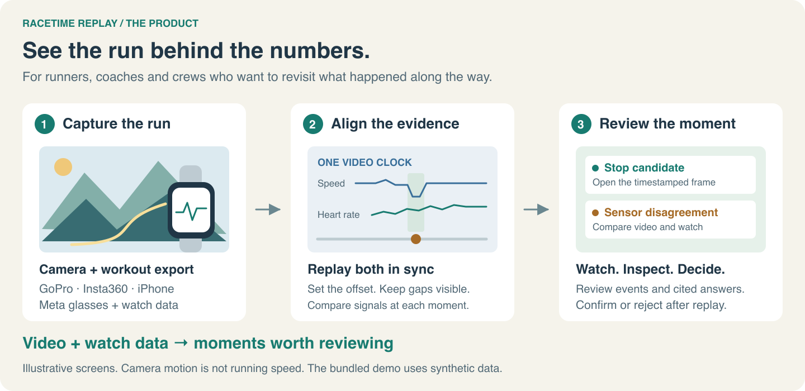
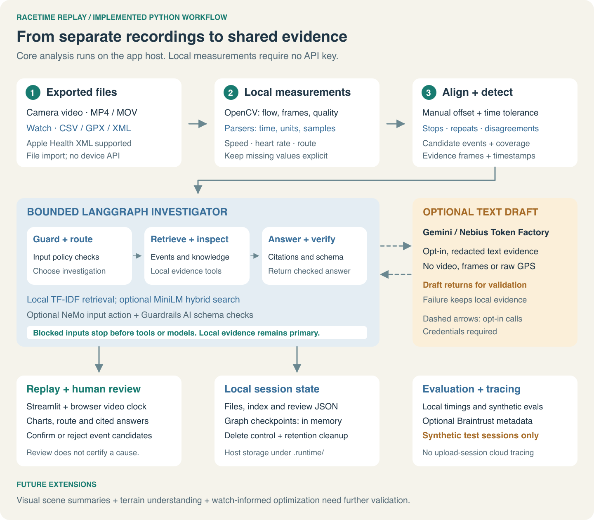

# RaceTime Replay

**See the run behind the numbers.** A Python application that aligns runner video with workout data so athletes can compare effort with visible context, review an evidence-backed performance summary and choose an improvement to test.

[Product story](docs/PRODUCT.md) · [Illustrated product guide](https://docs.google.com/document/d/1ujhgZyvU_iwvN8Z4r5HdnNiKc6jDUuyxJYR3qVIiGYo/edit) · [Week-by-week evidence](docs/WEEKLY_MAPPING.md) · [Developer guide](docs/DEVELOPER_GUIDE.md) · [Data guide](docs/DATA_GUIDE.md) · [Safety](docs/SAFETY.md) · [Nebius integration](docs/NEBIUS.md) · [Braintrust observability](docs/OBSERVABILITY.md)



[View the full-size intro diagram](assets/architecture/replay-readme-intro.svg)

## Who this is for

Trail runners and endurance athletes who want to revisit moments in their own recordings. Coaches and crew can review shared clips with permission. The first version saves the manual step of aligning separate evidence sources; measured time savings and performance benefits are still future validation work.

GoPro, Insta360, iPhone and camera-equipped Meta glasses offer several ways to capture first-person video. Sports watches such as Garmin, COROS, Suunto and Apple Watch record a different view of the same session. RaceTime accepts exported files and brings those records together. It does not claim every device supplies continuous video or identical metadata.

## The decision it helps you make

A rise in heart rate or a change in training zone can identify a moment worth reviewing. Video can show what was visible at that moment, such as uneven footing. Neither source alone establishes the cause of the change. The current workflow makes the comparison inspectable:

1. Align a recording with compatible workout samples and your own zone boundaries.
2. Compare heart rate, zone and pace with the matching video; inspect other recorded signals when available.
3. Ask for a measurement comparison with a reference back to the evidence.
4. Review the visible context, confirm the observation, and save an experiment to test on a comparable session.

The outcome is a reviewed next-run plan. Automated cross-session comparison and a measured performance gain remain future work. See the [performance review workflow](docs/PERFORMANCE_REVIEW.md).

## Run locally

```bash
git clone https://github.com/sivalinb/racetime-replay.git
cd racetime-replay
python3.12 -m venv .venv
source .venv/bin/activate
python -m pip install -r requirements.txt
streamlit run app.py
```

Select **Upload my recording** for your own MP4/MOV plus CSV, GPX or Health XML. Set the time offset, review aligned video and workout signals, and inspect candidate events. Read the [data guide](docs/DATA_GUIDE.md) for timestamp conventions. The prototype limits video to 15 minutes and 150 MB; core local analysis does not require an API key. In shared hosting, set `REPLAY_ALLOW_UPLOADS=false` until appropriate access and data-isolation controls are implemented.

## What works

- OpenCV video decoding, optical-flow motion and quality measurements.
- CSV, GPX and bounded Apple Health XML input with explicit unit conversion.
- Manual synchronization offset, nearest-sample alignment and missing-data preservation.
- One video clock driving heart rate, personal zones, pace, cadence, elevation and running power.
- Optional timestamped SpO₂ and explicitly sourced core-temperature readings; missing values stay missing.
- Measured start-to-peak comparisons and proposed experiments for human review, without a fitness score or promised gain.
- Candidate stops, repeated frames and video/speed disagreement detection.
- Timestamped evidence frames and explicitly saved human observations.
- A bounded LangGraph investigator with retrieval, tool fallbacks, reference checks and local node timings.
- Optional MiniLM hybrid retrieval and optional Gemini or Nebius drafts from redacted aggregate evidence.
- Reproducible evaluation, a real small LoRA experiment and executable guardrail checks.

## Architecture at a glance



[View the full-size architecture](assets/architecture/replay-readme-architecture.svg) · [Architecture details and diagram source](docs/ARCHITECTURE.md)

The local path turns exported recordings into measurements, candidate events and timestamped evidence. The browser keeps video and measurement charts on one clock; athletes can review events directly or ask the bounded investigator to explain the available evidence. Optional Gemini or Nebius drafts receive redacted text evidence, while optional Braintrust tracing is restricted to synthetic test metadata.

See the [performance review workflow](docs/PERFORMANCE_REVIEW.md) for how measured observations become a proposed experiment. Core temperature requires a compatible external sensor export; skin and ambient temperature are not substitutes. Supported file formats determine compatibility—native FIT/TCX and direct account sync are not implemented.

## What is intentionally future work

Automatic terrain recognition, rich vision-model summaries, physiological explanations, native device connections, multi-run comparison and personalized optimization are not implemented in this release. The roadmap explains how reviewed visual observations could later be combined with watch data and coach feedback.

The same concept could support a physiotherapist reviewing prescribed home exercise after a stroke or accident: a suitable full-body camera view alongside validated wearable measurements, with patient consent and clinician review. This is a proposed extension, not an implemented or clinically validated service. Workplace training and field inspections are other possible applications. See [future applications and their requirements](docs/ROADMAP.md#beyond-running).

## Verify the build

```bash
python -m pip install -r requirements-dev.txt
python -m pytest -q
ruff check .
ruff format --check .
PYTHONPATH=. python scripts/evaluate.py
```

Optional frameworks:

```bash
python -m pip install -r requirements-safety.txt
PYTHONPATH=. python scripts/check_guardrails.py
REPLAY_FRAMEWORK_GUARDS=true streamlit run app.py
```

Optional model/cloud checks:

```bash
cp .env.example .env
# Set local credentials only if you want cloud synthesis or synthetic tracing.
PYTHONPATH=. python scripts/check_integrations.py
```

The semantic model downloads from Hugging Face and runs locally. Gemini and Nebius are opt-in. Nebius needs `NEBIUS_API_KEY` and a current `NEBIUS_MODEL`. See [Nebius configuration and verified checks](docs/NEBIUS.md) and [Braintrust instrumentation and verification](docs/OBSERVABILITY.md). Integration success establishes connectivity and trace delivery; answer quality requires separate evaluation. Automatic tracing of uploaded media and health data is disabled. Course-specific LangSmith proof remains outstanding; the [weekly mapping](docs/WEEKLY_MAPPING.md) records the current status.

Current development evidence comprises 44 passing Python tests, [50 authored synthetic evaluation cases](reports/evaluation.json), and [five selected framework guardrail checks](reports/guardrails-evaluation.json). An [archived Braintrust integration report](reports/braintrust-integration.json) verifies eight spans and 163 tokens from a separate synthetic Nebius run. These checks establish the reported development behavior, not field accuracy, clinical safety or a performance benefit.

## Training

`training/train_router.py` compares a frozen BERT-tiny encoder with a trained classifier head against the same setup plus rank-8 LoRA adapters. It writes per-class metrics, confusion matrices, adapter and merged weights. The experiment improved accuracy from 52.5% to 60% on 40 separately worded synthetic test requests. This is weak performance, so the learned router is not the default. The course-specific Qwen3-1.7B/LLaMA-Factory recipe is supplied separately and is not claimed as executed.

```bash
python -m pip install -r training/requirements.txt
python training/train_router.py
python training/prepare_qwen.py
```

## Privacy and limitations

Raw uploads remain on the machine running the app. No external map service receives route coordinates. A public server would receive uploads; shared hosting must disable them until access, isolation and retention controls are in place. The optional cloud draft receives only redacted questions and aggregate evidence; redaction is not a comprehensive privacy guarantee. See the safety document for retention, threats, governance and release gates.

This project measures observations, not medical causes. Its published benchmark is synthetic. Real-run field validation and independent labels are still needed.
