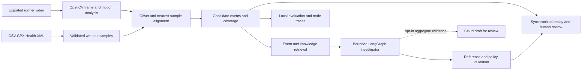

# Architecture


[Full-size editable SVG](../assets/architecture/replay-readme-architecture.svg) · [Product introduction](../assets/architecture/replay-readme-intro.svg)

## Data flow



Numerical analysis runs on the Python application's host. Streamlit serves a browser player whose small JavaScript component synchronizes video playback, charts and the route display. Candidate events are available for direct review without calling the investigator. No raw media is sent by the optional synthesis path. Scene recognition and training optimization belong to the future roadmap, not this architecture's implemented measurement path.


## State and optional services

Session files, indexes and human review notes stay on the application host. LangGraph checkpoints are in memory and do not survive a process restart. The diagram's review step refers to confirming or rejecting event candidates in the interface.

The default investigator uses local retrieval and evidence tools. MiniLM hybrid retrieval, NeMo's local input action and Guardrails AI schema validation are optional. Gemini and Nebius Token Factory provide opt-in text drafts; they do not inspect video in this version. Braintrust accepts allowlisted metadata only from explicitly enabled synthetic sessions. The separate LangSmith integration check and experimental LoRA router are described in the [weekly mapping](WEEKLY_MAPPING.md); neither is required by the default replay workflow.

## Maintaining the illustrations

The [Python generator](../scripts/build_readme_diagrams.py) creates both accessible, editable SVGs. Their illustrations contain no personal photographs or external assets. PNG previews are committed so the README displays consistently; keep the previews and SVGs in sync.

```bash
python scripts/build_readme_diagrams.py
```

Export the SVGs to PNG at their native dimensions using an SVG renderer. For example, with Node.js and the standalone Sharp renderer (not an application dependency):

```bash
npm install --prefix /tmp/replay-diagram-renderer sharp
NODE_PATH=/tmp/replay-diagram-renderer/node_modules node - <<'JS'
const sharp = require('sharp');
(async () => {
  for (const name of ['intro', 'architecture']) {
    const stem = `assets/architecture/replay-readme-${name}`;
    await sharp(`${stem}.svg`).png().toFile(`${stem}.png`);
  }
})();
JS
```

Inspect both previews for clipped text and readable labels before committing. Keep current capabilities separate from the future scene-understanding and optimization roadmap.
