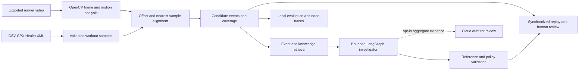

# Architecture

The player and all numerical analysis run on the Python application's host. No raw media is sent by the optional synthesis path. Scene recognition and training optimization belong to the future roadmap, not this architecture's implemented measurement path.
